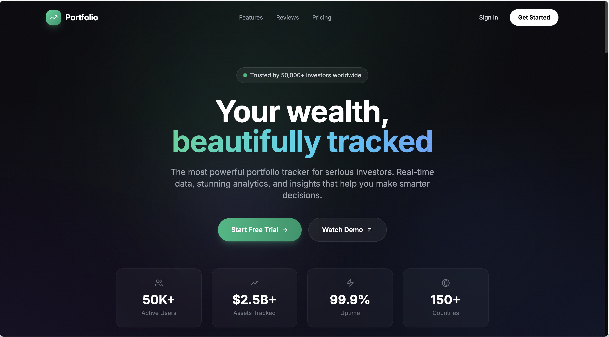
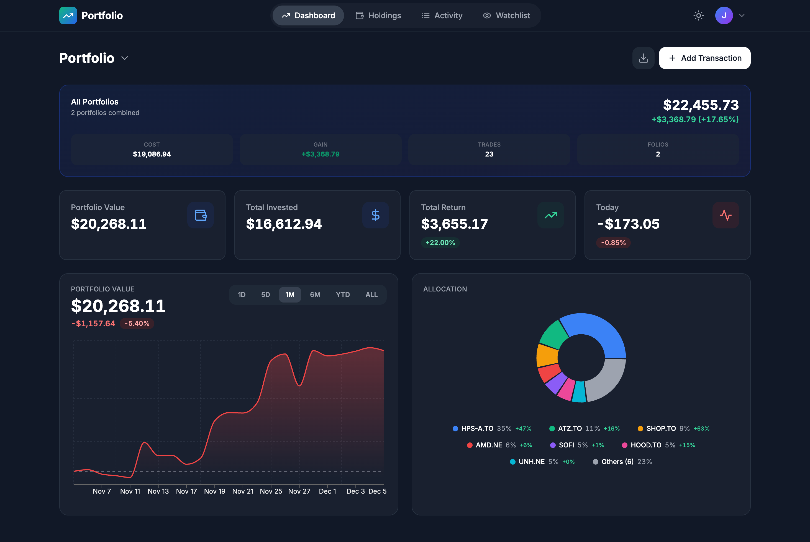
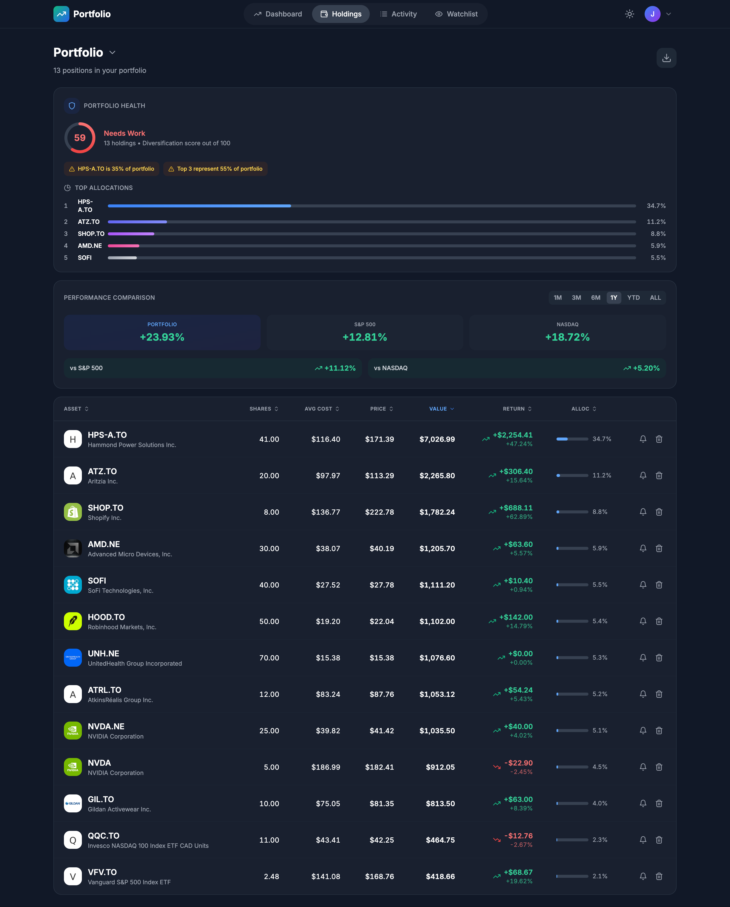
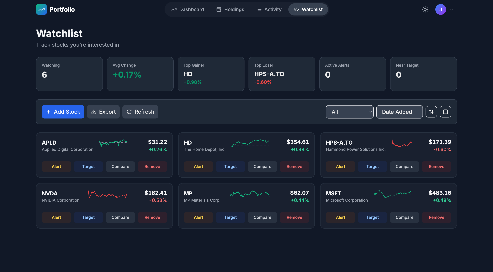
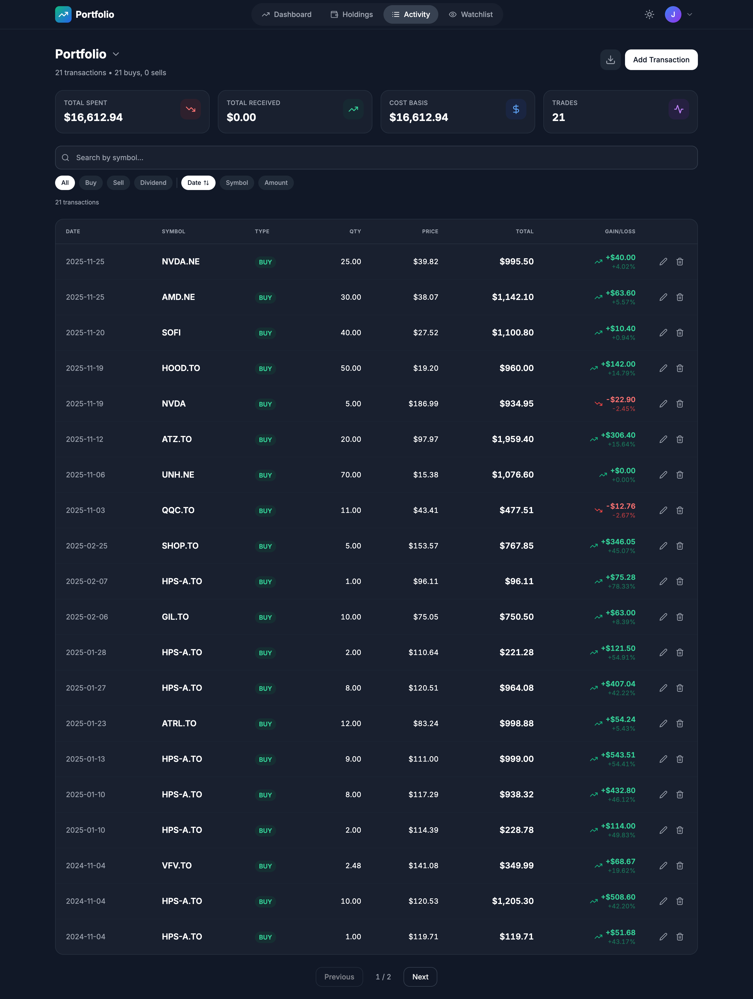

# Portfolio Watcher

A stock portfolio tracking app I built to manage my investments. It tracks multiple portfolios, calculates gains/losses, and gives you a clean view of how your stocks are performing.

**Live Demo:** [https://portfolio-watcher-lemon.vercel.app/](https://portfolio-watcher-lemon.vercel.app/)

## Screenshots


*Landing page with animated background and feature highlights*


*Main dashboard showing portfolio overview, performance chart, and stats*


*Holdings page with detailed stock information and allocation chart*


*Watchlist with real-time prices and sparklines*


*Transaction history with filtering and bulk operations*

## What it does

Track your stock portfolios with real-time prices, transaction history, and performance analytics. You can create multiple portfolios, import transactions from CSV (Yahoo Finance format), set price alerts, and monitor stocks on a watchlist.

The app uses Yahoo Finance for stock data (no API key needed), stores everything in Supabase, and has a responsive design that works well on mobile and desktop.

## Features

**Portfolio Management**
- Create and manage multiple portfolios
- Track buy/sell/dividend transactions
- Automatic holding calculations
- CSV import from Yahoo Finance exports
- Real-time portfolio value updates

**Analytics & Charts**
- Portfolio performance over time (1D, 5D, 1M, 6M, YTD, All)
- Gain/loss calculations with percentages
- Asset allocation pie charts
- Cost basis tracking
- Period-based performance comparisons

**Watchlist**
- Monitor stocks without adding to portfolio
- Real-time price updates with sparklines
- Price alerts (above/below thresholds)
- Target price tracking
- Quick add/remove with undo

**Transactions**
- Full transaction history with filtering
- Edit and delete transactions
- Bulk operations
- Chronological sorting
- Export to CSV

**User Experience**
- Dark mode
- Responsive design (mobile-first)
- Skeleton loading states
- Toast notifications with undo
- Smooth animations and transitions

## Tech Stack

- **Next.js 14** (App Router) - React framework
- **TypeScript** - Type safety
- **Tailwind CSS** - Styling
- **Supabase** - Database and authentication
- **Recharts** - Data visualization
- **Lucide React** - Icons

## Getting Started

### Prerequisites

- Node.js 18 or higher
- A Supabase account (free tier works fine)

### Setup

1. Clone the repo:
```bash
git clone <your-repo-url>
cd portfolio-watcher
```

2. Install dependencies:
```bash
npm install
```

3. Set up environment variables:
Create a `.env.local` file in the root directory:
```env
NEXT_PUBLIC_SUPABASE_URL=your_supabase_url
NEXT_PUBLIC_SUPABASE_ANON_KEY=your_supabase_anon_key
LOGO_DEV_API_KEY=your_logo_dev_api_key
```

4. Set up the database:
Run the SQL schema from `supabase/schema.sql` in your Supabase SQL editor. This creates the tables for portfolios, transactions, watchlist, and alerts.

5. Configure Supabase Auth:
In your Supabase dashboard, set up email authentication and configure the redirect URLs:
- `http://localhost:3000/auth/callback` (development)
- `https://yourdomain.com/auth/callback` (production)
- `http://localhost:3000/reset-password` (password reset)
- `https://yourdomain.com/reset-password` (password reset)

6. Run the dev server:
```bash
npm run dev
```

Open [http://localhost:3000](http://localhost:3000) in your browser.

### Building for Production

```bash
npm run build
npm start
```

For deployment, check out `DEPLOYMENT.md` for detailed Vercel setup instructions.

## How it works

**Stock Data**
The app fetches stock prices from Yahoo Finance's public API endpoints. No API key required. Data is cached client-side to reduce API calls, and there's smart cache invalidation to keep prices fresh.

**Data Storage**
Everything is stored in Supabase - portfolios, transactions, watchlist items, and user alerts. The app syncs transactions to keep the database in sync with client state.

**Calculations**
Portfolio values are calculated by:
1. Fetching current prices for all holdings
2. Calculating total cost basis from transactions
3. Computing unrealized gains/losses
4. Tracking performance over different time periods

Historical portfolio values are calculated by reconstructing the portfolio at different points in time using transaction history and historical price data.

## Project Structure

```
app/
  ├── api/              # API routes for stock data
  ├── auth/             # Authentication pages
  ├── dashboard/        # Main dashboard
  ├── holdings/         # Holdings page
  ├── transactions/     # Transaction history
  ├── watchlist/        # Watchlist page
  └── profile/          # User profile

components/
  ├── skeletons/        # Loading state components
  └── ...               # Various UI components

lib/
  ├── stockService.ts   # Stock data fetching
  ├── storage.ts        # Supabase operations
  ├── portfolioCalculator.ts  # Portfolio calculations
  ├── portfolioPerformance.ts # Performance metrics
  └── historicalPortfolio.ts  # Historical data

supabase/
  ├── schema.sql        # Database schema
  └── migrations/       # Database migrations
```

## Key Implementation Details

**Transaction Syncing**
When you delete or modify transactions, the app uses a sync function that compares the current state with the database and only makes the necessary changes (insert/update/delete). This prevents unnecessary database calls.

**Caching Strategy**
Stock prices are cached with different TTLs:
- Real-time quotes: 1 minute
- Search results: 5 minutes
- Historical data: varies by period

The cache is invalidated when data becomes stale, and you can force a refresh from the UI.

**Performance Optimizations**
- Memoized calculations for expensive operations
- Debounced search inputs
- Lazy loading for charts
- Optimistic UI updates
- Client-side caching to reduce API calls


## Notes

- Yahoo Finance API is free but rate limits can apply with heavy usage
- The app handles missing data gracefully (e.g., when markets are closed)
- Historical data uses forward-fill for missing intraday prices to prevent chart gaps
- All calculations use proper date handling to avoid timezone issues

## License

MIT
